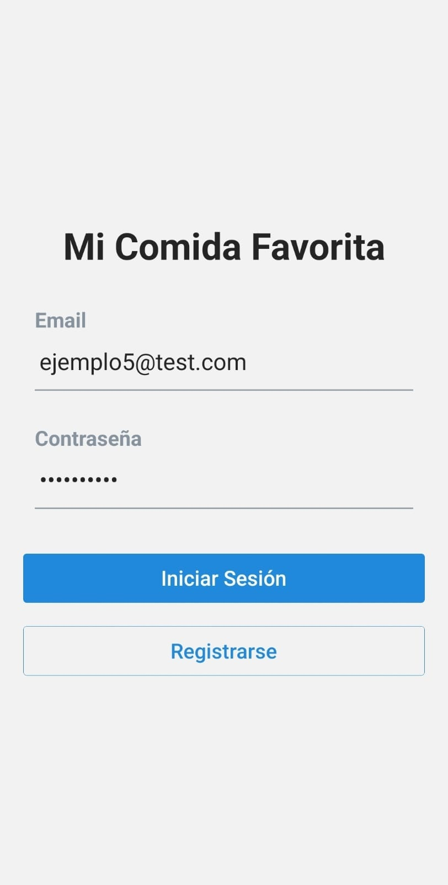
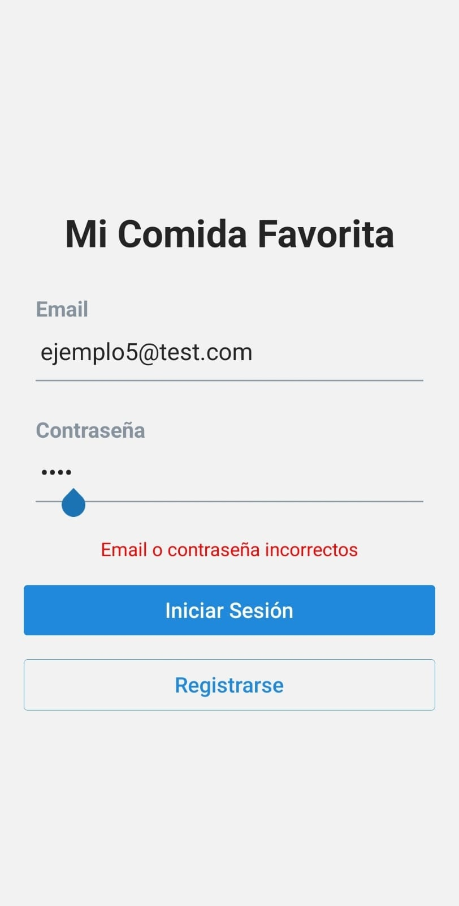
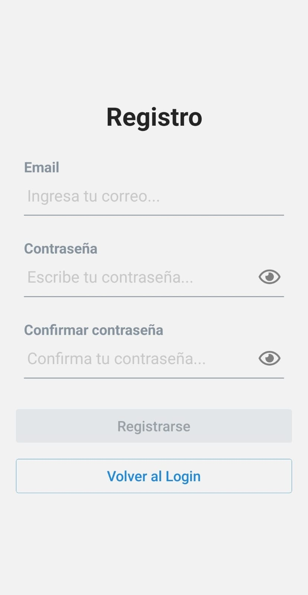
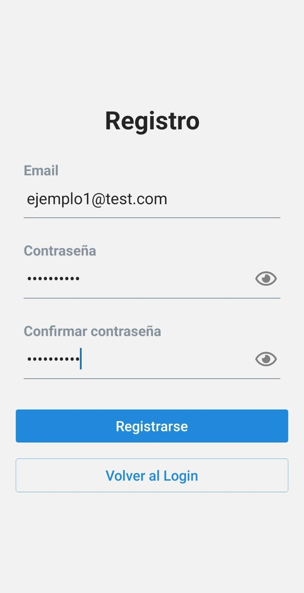
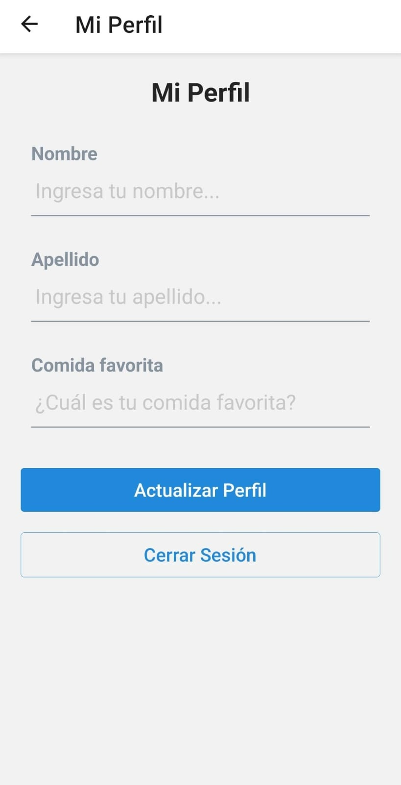
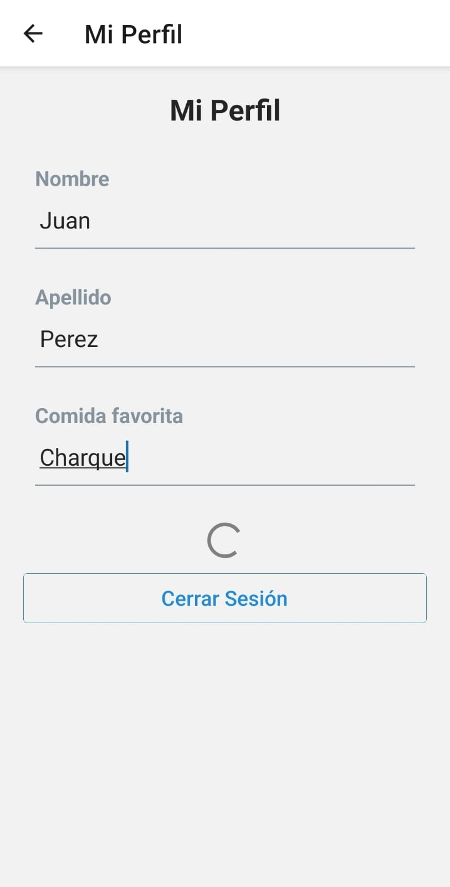

# 📱 Mi comida Favorita

Aplicación desarrollada con **React Native** usando **Expo**. Permite gestionar, visualizar y guardar tus comidas favoritas.

## 🚀 Cómo iniciar el proyecto

1. **Clona el repositorio:**

```bash
git clone https://github.com/JoseVelascoM/mi-comida-favorita-diplomado
cd mi_comida_favorita_app
```

2. **Instala las dependencias:**

```bash
npm install
# o
yarn install
```

3. **Configura Firebase:**

En el archivo src/config/firebase.ts, debes agregar las credenciales de tu proyecto de Firebase (desde la consola de Google). Este archivo debe incluir la configuración como:

```ts
const firebaseConfig = {
  apiKey: '<API_KEY>',
  authDomain: '<AUTH_DOMAIN>',
  projectId: '<PROJECT_ID>',
  storageBucket: '<STORAGE_BUCKET>',
  messagingSenderId: '<MSG_SENDER_ID>',
  appId: '<APP_ID>',
  measurementId: '<MEASUREMENT_ID>',
};
```

4. **Inicia la app en modo desarrollo:**

```bash
npx expo start
```

Luego escanea el código QR con la app de Expo Go en tu dispositivo móvil.

## 📦 Dependencias principales

- Expo
- React Navigation
- Firebase
- TypeScript

## 📝 ChangeLog

Aquí puedes ir anotando los cambios realizados en cada versión.

#### [v1.0.1] - 2025-05-19

- Validaciones de formulario en la página de registro.
- Campo de confirmación de contraseña agregado en la página de registro.
- Validación de contraseñas agregada en la página de registro.
- Evitar el envío de formularios cuando hay errores de validación.
- Se agregó mensajes de error de validación en la página de registro.
- Validación de correo y contraseña agregados en la página de login.
- Botón de inicio de sesión deshabilitado cuando no se ingresan datos válidos.
- Implementación de indicadores de carga en la página de login durante la interacción con el servidor.
- Implementación de indicadores de carga en la página de registro durante la interacción con el servidor.
- Implementación de indicadores de carga en la página de perfil durante la interacción con el servidor.

#### [v1.0.0] - 2025-05-14

- Proyecto inicial creado.
- Estructura básica de navegación.
- Integración con Firebase.
- Pantallas de Login, Registro y Perfil agregadas.

## 📂 Estructura del proyecto (resumen)

```lua
mi_comida_favorita_app/
├── assets/
├── src/
│   ├── config/
│   │   └── firebase.ts
│   ├── navigation/
│   └── screens/
├── App.tsx
├── index.ts
├── metro.config.js
├── package.json
└── README.md
```

## ✨ Notas

Asegúrate de tener Node.js, npm o yarn, y la app Expo Go instalada.

## 📸 Capturas de pantalla

#### Inicio de sesión
<p float="left">
  
  
  
</p>

#### Registro
<p float="left">
  
  
</p>


#### Perfil
<p float="left">
  
  
</p>
